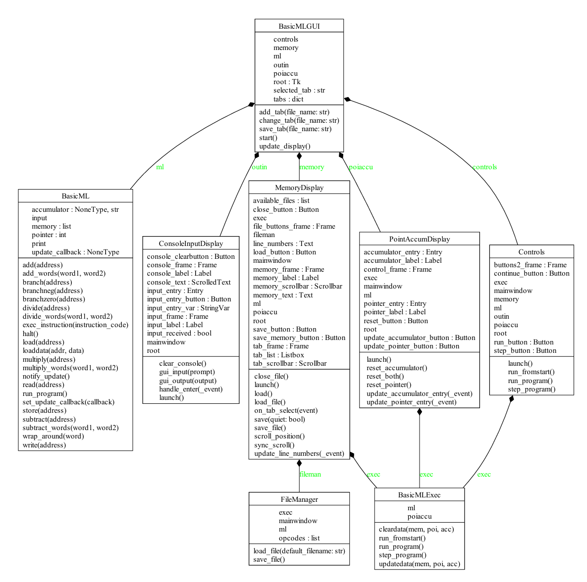
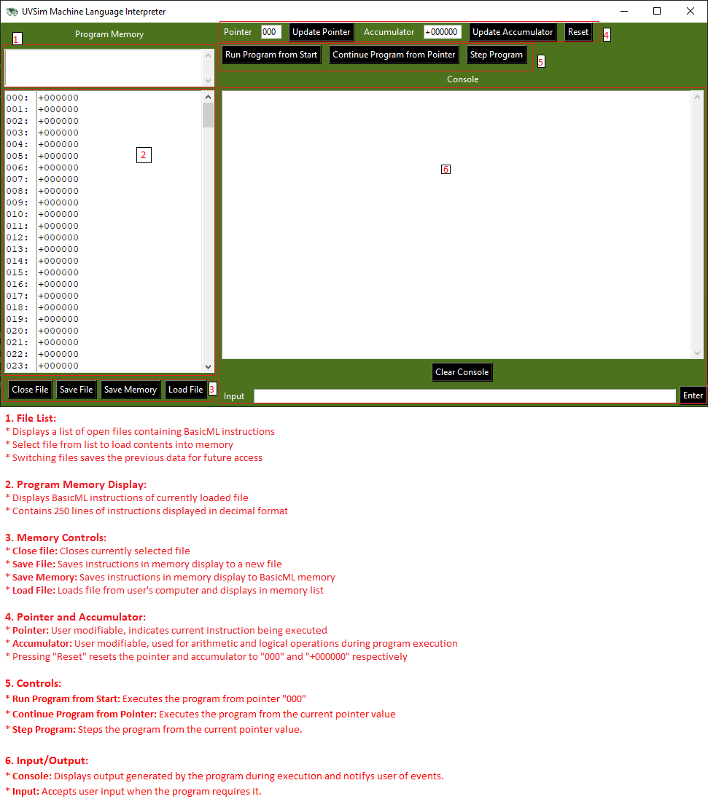

# BasicML

## Overview

BasicML is a simple virtual machine that simulates a basic machine language using python and tkinter. It operates with a memory of 100 words and a single accumulator register. The program supports various operations such as loading, storing, adding, subtracting, multiplying, and dividing values. This document provides an overview of the program, its operations, and instructions for usage.

## Features

- 100-word memory
- Single accumulator register
- Supports arithmetic operations: addition, subtraction, multiplication, and division
- Handles overflow by wrapping around and flipping the sign
- Supports load and store operations
- Supports control operations: halt, branch, branchneg, branchzero
- Full graphical functionality

## Installation

1. Ensure you have Python installed on your machine.
2. Ensure that tkinter is installed before executing.
3. Clone the repository to your local machine.

## GUI file execution tutorial:

- After running the file by executing `main.py` and ensuring that tkinter is installed on your machine, click the `Load File` button in the upper left hand corner.
- Select file to execute.
- Click the `Run Program from Start` file. The application will then follow the instructions in the instruction file and display its contents to the console.
- The `Program Memory` is editable and requires signed 4 digit numbers. An error will display in the console if an invalid input is inserted and attempted to save into memory.
- Clicking on the `Save Memory` button will save the contents of the memory display into program memory.
- Clicking the `Update pointer` button will update the accumulator and the pointer with the values in the pointer and accumulator. Pressing enter in the accumulator and pointer fields does the same thing.
- Clicking the `Update Accumulator` button will update the accumulator and the pointer with the values in the pointer and accumulator. Pressing enter in the accumulator and pointer fields does the same thing.
- Clicking the `Reset` button will clear the console and reset the pointer and accumulator.
- Clicking the `Save File` button will allow you to save the current contents of the memory to a file you specify.
- Clicking the `Continue Program from Pointer` will continue the program from the current pointer value until halted.
- Clicking the `Step Program` button will run one instruction per click.
- Clicking `Clear Console` will clear the content stored in the console.

## Usage

- Load any file from the file dialogue that has 5 character length words per line.
- Program will provide an error if the file is not in the correct format.
- You may choose to modify the color scheme by editing the values in `theme.py`. A restart is required to apply these changes.

## Running the Program

Open a terminal and navigate to the directory containing `main.py` in the `src` folder for the project and execute `main.py`.

## What the program does/can do

- Loads a value from a specified memory address into the accumulator.
- Adds a value from another memory address to the accumulator.
- Stores the result in a different memory address.
- Prints the memory and accumulator values after execution.

## Arithmetic Operations

- **Addition (30)**: Adds a word from a specified memory address to the accumulator.
- **Subtraction (31)**: Subtracts a word from a specified memory address from the accumulator.
- **Multiplication (33)**: Multiplies a word from a specified memory address by the accumulator.
- **Division (32)**: Divides the accumulator by a word from a specified memory address.

## Handling of Overflow

When results exceed four digits, BasicML handles the overflow by truncating and keeping the same sign. For example:

- `-9999 + -0002` results in `-0001`
- `+9999 + +0002` results in `+0001`

## I/O operation:

- **READ = 10** Read a word from the keyboard into a specific location in memory.
- **WRITE = 11** Write a word from a specific location in memory to screen.

## Load/store operations:

- **LOAD = 20** Load a word from a specific location in memory into the accumulator.
- **STORE = 21** Store a word from the accumulator into a specific location in memory.

## Control operation:

- **BRANCH = 40** Branch to a specific location in memory
- **BRANCHNEG = 41** Branch to a specific location in memory if the accumulator is negative.
- **BRANCHZERO = 42** Branch to a specific location in memory if the accumulator is zero.
- **HALT = 43** Stop the program
